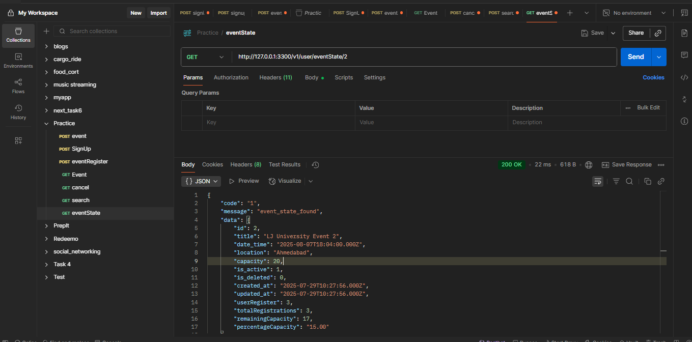
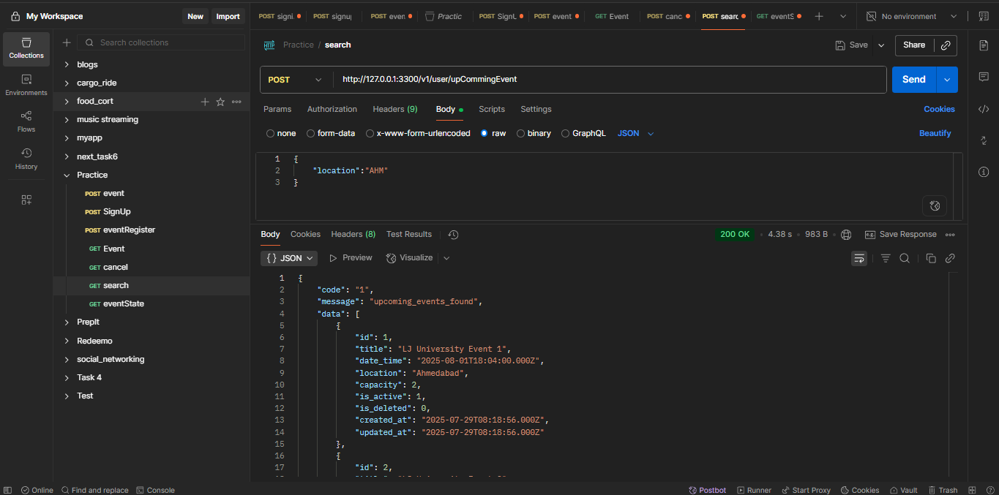
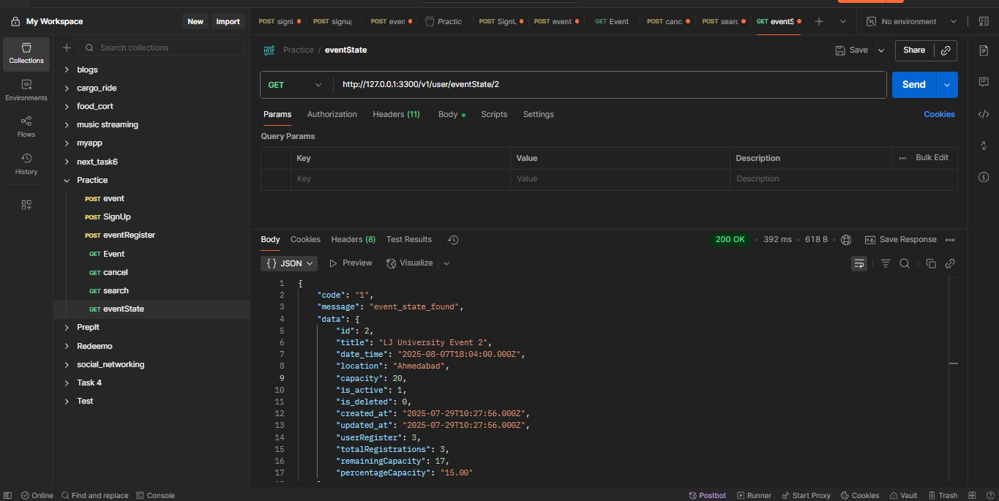

# 🎉 Event Management API

A Node.js-based RESTful API for event registration and user management.

---

## 🚀 Getting Started

### 1. Install Dependencies

```bash
npm i bcrypt colors cors crypto dotenv express joi jsonwebtoken localizify multer mysql2 nodemon

2. Setup Database
Configure your MySQL database and update .env file with credentials.
📬 API Endpoints
➕ POST Methods
Endpoint	Description
http://127.0.0.1:3300/v1/user/event	Create a new event
http://127.0.0.1:3300/v1/user/signup	User registration
http://127.0.0.1:3300/v1/user/eventRegister	Register for an event

📥 GET Methods
Endpoint	Description
http://127.0.0.1:3300/v1/user/event	Fetch all events
http://127.0.0.1:3300/v1/user/cancel	Cancel event registration
http://127.0.0.1:3300/v1/user/upCommingEvent	Get upcoming events
http://127.0.0.1:3300/v1/user/eventState/2	Events based on state ID

📦 EventManagement
├── 📁 controller
├── 📁 middleware
├── 📁 model
├── 📁 route
├── 📁 screenshot
├── 📁 validation
├── .env
├── app.js
└── package.json


🛠️ Tech Stack
Backend: Node.js, Express
Database: MySQL
Validation: Joi
 ```
# 📸 Screenshots

Screenshots are available in the `screenshot/` folder for visual reference.





